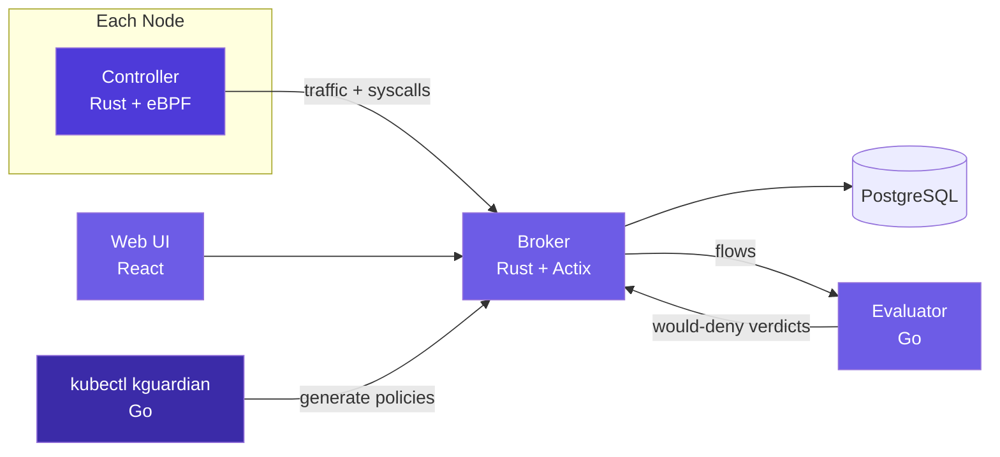

<div align="center">

<picture>
  <source media="(prefers-color-scheme: dark)" srcset="docs/logo/dark.svg">
  
</picture>

_Least-privilege Kubernetes security policies, generated from what your pods actually do_

</div>

<div align="center">

[](https://docs.kguardian.dev)&nbsp;&nbsp;
[](https://kubernetes.io/)&nbsp;&nbsp;
[](LICENSE)&nbsp;&nbsp;

</div>

<div align="center">

[](https://github.com/kguardian-dev/kguardian/releases)&nbsp;&nbsp;
[](https://github.com/kguardian-dev/kguardian/actions/workflows/security-scan.yaml)&nbsp;&nbsp;
[](https://github.com/kguardian-dev/kguardian/stargazers)&nbsp;&nbsp;
[](https://github.com/kguardian-dev/kguardian/commits/main)&nbsp;&nbsp;

</div>

<div align="center">

[Overview](#-overview) · [In action](#-in-action) · [Features](#-features) · [Architecture](#️-architecture) · [Quick Start](#-quick-start) · [Usage](#️-usage) · [AI Assistant](#-ai-assistant) · [Compatibility](#-compatibility) · [Performance](#-performance) · [Telemetry](#-telemetry) · [Contributing](#-contributing) · [License](#-license)

</div>

# 🔭 Overview

kguardian watches pod traffic and syscalls with eBPF, then writes Kubernetes `NetworkPolicy`, `CiliumNetworkPolicy`, and seccomp profiles from what it sees — no hand-authored rules.

It's built for platform and security teams who want policy-as-code without writing rules by hand: the Controller (an eBPF DaemonSet) captures every TCP/UDP connection and syscall on each node, the Broker stores the per-pod baseline in PostgreSQL, and the `kubectl kguardian` plugin turns that baseline into least-privilege policy YAML for any pod, namespace, or the whole cluster.

## 📸 In action

<table>
  <tr>
    <td width="50%" align="center">
      <a href="docs/images/readme/network-map.png"></a>
      <br /><sub><b>Network Map</b> — every flow eBPF saw, in one graph: trusted, egress, and would-deny edges for a live namespace (here, Flux).</sub>
    </td>
    <td width="50%" align="center">
      <a href="docs/images/readme/policy-builder.png"></a>
      <br /><sub><b>Policy Builder</b> — a least-privilege <code>NetworkPolicy</code> or <code>CiliumNetworkPolicy</code> written from what the workload actually did.</sub>
    </td>
  </tr>
  <tr>
    <td width="50%" align="center">
      <a href="docs/images/readme/seccomp-profiles.png"></a>
      <br /><sub><b>Seccomp Profiles</b> — per-workload syscall allow-lists with node readiness and drift against the deployed <code>SeccompProfile</code>, audit mode by default.</sub>
    </td>
    <td width="50%" align="center">
      <a href="docs/images/readme/seccomp-export.png"></a>
      <br /><sub><b>Policy as code</b> — export the <code>SeccompProfile</code> CR, see the diff against what is deployed, commit it. kguardian never applies anything itself.</sub>
    </td>
  </tr>
</table>

## ✨ Features

- **Network Policy generation** — least-privilege Kubernetes `NetworkPolicy` and Cilium `CiliumNetworkPolicy` resources from observed pod-to-pod traffic. Each flow's peer is identified when it is captured, not when a policy is generated, so a recycled pod IP never allow-lists the wrong workload ([how peers are attributed](https://docs.kguardian.dev/concepts/peer-attribution)).
- **Seccomp profile generation** — per-workload syscall allowlists derived from runtime traces, exported as a `SeccompProfile` CR you commit; the controller places the file on every node only once you apply it. Capture is tiered (`full` by default, cheap thanks to in-BPF dedup; `high`/`medium`/`low`/`custom` for monitoring-only clusters), and only a `full` capture yields a profile safe to enforce.
- **Live compute gauges and noisy-neighbour detection** — every pod on the map carries a live CPU/memory gauge from cgroup v2, and the broker raises a finding when a pod is starved (`noisy-neighbor`, `cpu-contended`, `memory-pressure`) or under-provisioned by its own limits (`cpu-throttled`, `memory-limit-thrash`). With the optional eBPF scheduler probe it names the pod, system unit or kernel thread that was on the CPU while the victim waited — and it never blames a neighbour for a pod's own CFS throttling ([how it works](https://docs.kguardian.dev/concepts/compute-contention)).
- **Policy auditing before enforcement** — the `AuditNetworkPolicy` CRD is byte-identical to an upstream `NetworkPolicy`, but instead of dropping packets the evaluator reports every flow the policy *would* deny. Ship policies with confidence instead of blackholing production.
- **Flexible targeting** — generate per-pod, per-namespace, or cluster-wide.
- **Review-first by design** — the CLI writes YAML to `--output-dir` and never applies anything to the cluster; you review and `kubectl apply` the files yourself.
- **GitOps-friendly output** — plain YAML/JSON files ready for review or a GitOps pipeline.
- **Optional AI assistant** — query traffic and syscall data in natural language via the LLM Bridge, in the web UI or from your own MCP client.

Example policies for common workloads (nginx, Postgres, kube-dns, Prometheus, Istio sidecar, a Go microservice) live in the [Policy Gallery](docs/policy-gallery/). For a comparison with Inspektor Gadget and Security Profiles Operator, see the [docs site](https://docs.kguardian.dev/#comparison-with-other-tools).

## 🏗️ Architecture



| Component | Language | Runs as | Purpose |
| --- | --- | --- | --- |
| **Controller** | Rust + eBPF (C) | DaemonSet | Captures every TCP/UDP connection and syscall on each node |
| **Broker** | Rust (Actix) | Deployment + PostgreSQL | Stores per-pod behavioral baselines and serves the API |
| **Evaluator** | Go | Deployment | Evaluates live flows against `AuditNetworkPolicy` CRDs and reports would-deny verdicts — without dropping a packet |
| **CLI** (`kubectl kguardian`) | Go | kubectl plugin | Generates NetworkPolicies and seccomp profiles from the observed baseline |
| **Web UI** | React + TypeScript | Deployment | Visualizes traffic, policies, and pod behavior |
| **LLM Bridge** | TypeScript | Optional Deployment | Natural-language assistant over cluster traffic — runs all tools and policy/seccomp generation in-process, and optionally serves them to external MCP clients ([llm-bridge/README.md](llm-bridge/README.md)) |

## 🚀 Quick Start

**Prerequisites:** Kubernetes v1.19+, `kubectl` v1.19+, and Linux kernel **6.2+** on every node that runs the Controller DaemonSet (see [Compatibility](#-compatibility)).

Install the in-cluster components with Helm, then the `kubectl` plugin:

```bash
helm install kguardian oci://ghcr.io/kguardian-dev/charts/kguardian \
  --namespace kguardian --create-namespace
sh -c "$(curl -fsSL https://raw.githubusercontent.com/kguardian-dev/kguardian/main/scripts/quick-install.sh)"
```

Give the Controller some time to observe real traffic, then generate policies:

```bash
# Least-privilege NetworkPolicy for one pod (dry-run, saved to ./policies)
kubectl kguardian gen networkpolicy my-pod -n default --output-dir ./policies

# Cilium policies for every pod in a namespace
kubectl kguardian gen netpol --all -n staging --type cilium --output-dir ./policies

# Seccomp profiles for all pods in all namespaces
kubectl kguardian gen seccomp -A --output-dir ./seccomp
```

Review the generated YAML, then apply it yourself (`kubectl apply -f ./policies`). Manual download, custom Helm values, Kind setup, verification, upgrades, and uninstall are covered in the [Installation Guide](https://docs.kguardian.dev/installation).

## 🛠️ Usage

The plugin follows the standard `kubectl` command structure:

```bash
kubectl kguardian gen <networkpolicy|seccomp> [pod-name] [flags]
```

| Flag | Applies to | Description |
| --- | --- | --- |
| `-n, --namespace` | both | Namespace scope (defaults to current context namespace) |
| `--all` | both | All pods in the selected namespace (`-a` shorthand: networkpolicy only) |
| `-A, --all-namespaces` | both | All pods in all namespaces |
| `--output-dir` | both | Directory for generated files (`network-policies` / `seccomp-profiles`) |
| `-t, --type` | networkpolicy | `kubernetes` (default) or `cilium` |
| `--dry-run` | networkpolicy | `true` (default). Applying directly is not implemented yet — the CLI always writes files only |
| `--default-action` | seccomp | Action for unlisted syscalls: `SCMP_ACT_ERRNO` (default), `SCMP_ACT_LOG`, `SCMP_ACT_KILL` |

Full command reference, including audit workflows and advanced flags, is in the [CLI docs](https://docs.kguardian.dev/cli).

## 🤖 AI Assistant

kguardian ships an optional natural-language assistant: ask questions like *"what has this pod talked to in the last hour?"* or *"generate a seccomp profile for the payments namespace"* from the Web UI. It's a single service, the LLM Bridge (SSE streaming), that reads the broker's data directly and generates policies and seccomp profiles in-process — bring your own API key for OpenAI, Anthropic, Gemini, or GitHub Copilot.

```yaml
ai:
  enabled: true
  provider: anthropic          # openai | anthropic | gemini | copilot
  secret: kguardian-anthropic  # Secret holding the key under `api-key`
```

Running an OpenAI-compatible gateway (LiteLLM, vLLM, a proxy)? Add `ai.baseUrl` and `ai.model`. Two things to know: the API key is still required — provider availability is gated on the key alone, so point `ai.secret` at your gateway's virtual key (or a dummy value if it's unauthenticated) — and kguardian appends the request path to your base URL **verbatim**, never adding or stripping `/v1`. See the [AI assistant setup](https://docs.kguardian.dev/installation#ai-assistant).

### 🔌 Connect your own MCP client

The same 12 tools can be served over MCP at `POST /mcp` on the LLM Bridge, so Claude Code — or any MCP client — can read your cluster's observed telemetry and write policies from it. Off by default; enable with `ai.mcp.*`, port-forward, and add one server entry:

```bash
kubectl -n kguardian port-forward svc/kguardian-llm-bridge 8080:8080
claude mcp add --transport http kguardian http://localhost:8080/mcp \
  --header "Authorization: Bearer $KGUARDIAN_MCP_TOKEN"
```

Full walkthrough: [Connect an MCP Client](https://docs.kguardian.dev/guides/mcp-endpoint). Env vars, routes, and local development: [llm-bridge/README.md](llm-bridge/README.md).

## 🧩 Compatibility

The eBPF Controller requires Linux kernel **6.2 or newer** on every node in the DaemonSet. Verify with `uname -r` before installing.

| Distro | Default kernel | Compatible? |
| --- | --- | --- |
| Ubuntu 24.04 | 6.8 | ✅ |
| Ubuntu 22.04 | 5.15 | ❌ (needs HWE 6.2+) |
| RHEL 9 | 5.14 | ❌ |
| Amazon Linux 2023 | 6.1 | ❌ (needs kernel-6.12+ AMI) |
| Debian 12 | 6.1 | ❌ (needs backports) |
| Talos / Bottlerocket | usually 6.1+ | check distro version |

Kernel versions reflect the GA/server defaults shipped by each distro as of May 2026; newer kernels are typically available via each distro's opt-in channels.

### IP families

IPv4, IPv6, and dual-stack clusters are all supported. The Controller reads both `AF_INET` and `AF_INET6` sockets, and policy generation emits `/32` or `/128` ipBlocks per peer — a dual-stack pod gets both families in one policy.

Things to know:

- **Dual-stack pods and Services are tracked on every address**, not just the primary one in `.status.podIP` / `.spec.clusterIP`. A peer is therefore resolved to a `podSelector` regardless of which family the traffic used.
- **Nodes built with `CONFIG_IPV6=n`** are handled: the IPv6 socket fields are read behind a CO-RE existence guard, so the Controller loads and runs normally on such kernels — it simply never sees v6 flows there.
- **Every service listener is dual-stack.** The broker, frontend, llm-bridge and evaluator bind the IPv6 unspecified address (accepting IPv4 as v4-mapped) and fall back to IPv4-only on kernels without IPv6 — so the stack serves IPv4-only, dual-stack, and IPv6-only clusters alike. The broker's `LISTEN_ADDR` env still binds verbatim when set.
- **Kernels with IPv6 as a module but no module BTF** (kernels older than 5.11, or built with `CONFIG_DEBUG_INFO_BTF_MODULES=n` — Debian 11's 5.10 is the common case) can't attach the IPv6 UDP probes. The Controller detects this at startup, logs a warning, and runs with those probes disabled rather than failing; IPv6 TCP capture is unaffected.
- **UDP flows are captured from connected sockets** (glibc's DNS resolver connects, so pod DNS is covered on both families). Unconnected `sendto()` datagrams carry no destination on the socket at the probe point and are not captured — the same behaviour IPv4 has always had, notable mainly for musl-based (Alpine) resolvers.

A generated policy is only as complete as what was observed. If a workload speaks both families but was only exercised over one during the observation window, the policy will reflect that — review before enforcing, as always.

## 📊 Performance

Reference figures from a real-world deployment — a 3-node cluster (18 vCPU / 47 GiB RAM per node, Cilium CNI) observing 234 pods across 26 namespaces of mixed traffic:

- **Controller (eBPF DaemonSet):** ~60 MiB memory and ~0.1–0.6 vCPU per node, tracking the node's connection/syscall rate.
- **Broker + evaluator:** evaluator ~26 MiB / <0.01 vCPU idle; broker sized at 512 MiB request / 2 GiB limit with plenty of headroom at this scale.
- **PostgreSQL** is the dominant consumer (~0.4–2 GiB RAM here, CPU spiking under ingest + autovacuum) — size it generously.
- **Storage growth is dedup-bounded:** once a workload's flow set is learned, new rows drop to ~0/min in steady state. The database grows with *new* behavior, not with time or traffic volume; `broker.audit.retention.days` caps the audit-verdict history.

This is one measured data point, not a synthetic sweep — treat it as an order-of-magnitude envelope. Expect numbers to scale with flow cardinality, not raw pod count.

## 📡 Telemetry

The broker performs a daily anonymous version check-in that powers the UI's update notice and is the project's only usage signal. Exactly six fields are sent — a random install UUID, broker/chart/Kubernetes versions, node count, and CPU architecture; no cluster names, IPs, or workload data, ever. It's on by default, announced at install time, documented field-by-field in the [telemetry docs](https://docs.kguardian.dev/telemetry), and disabled with `--set telemetry.enabled=false`.

## 🤝 Contributing

Contributions are welcome — read the [contributing guide](CONTRIBUTING.md) to get started. The release process and versioning strategy are documented in [RELEASES.md](RELEASES.md), and security reports go through [SECURITY.md](SECURITY.md).

## 📄 License

Licensed under the [Business Source License 1.1](LICENSE):

- **Free for** development, testing, evaluation, and non-production/non-commercial use
- **Commercial use** requires a commercial license (contact the licensors)
- **Converts to** Apache License 2.0 on January 1, 2029
